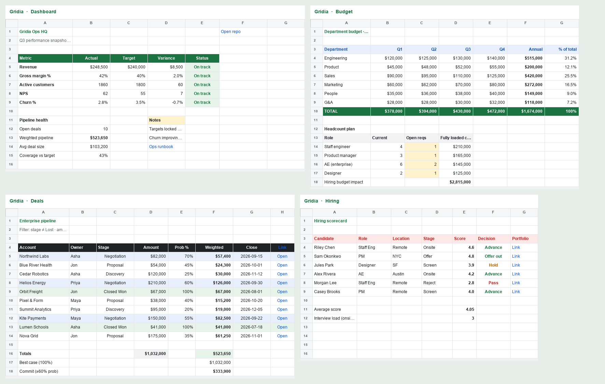
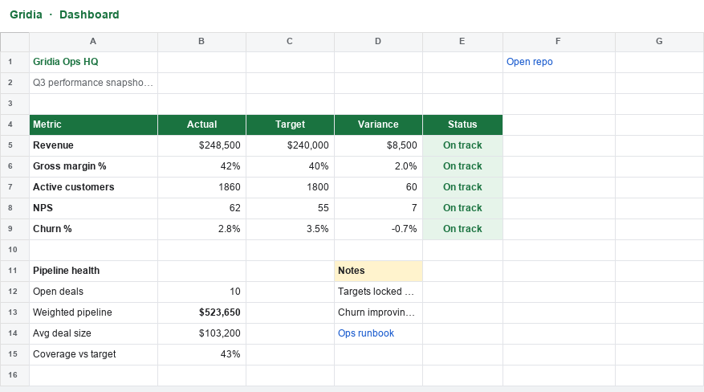
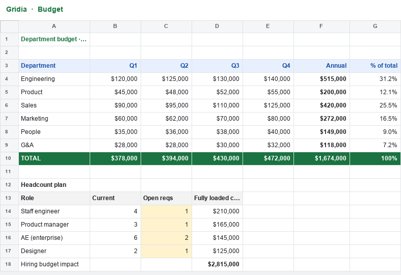
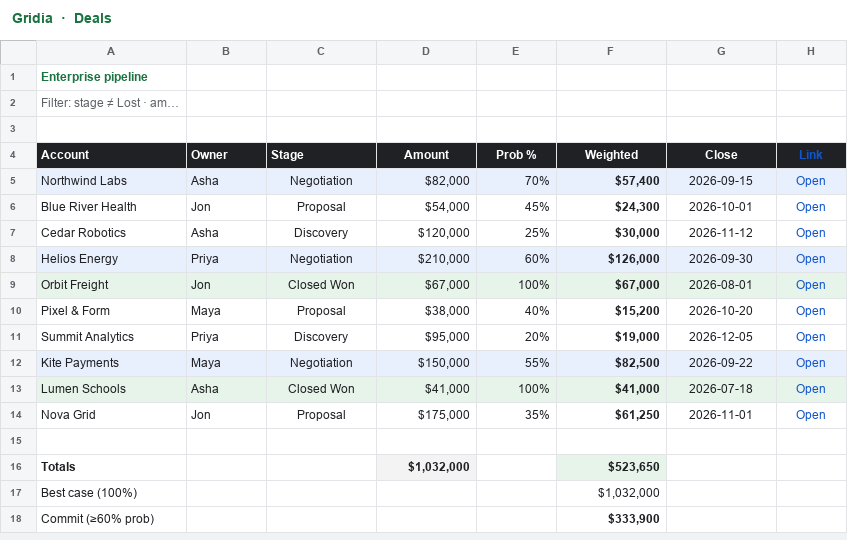
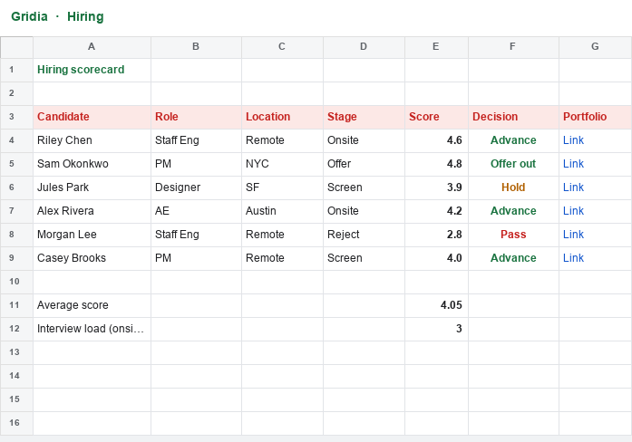

# Gridia

A pure in-browser spreadsheet inspired by Google Sheets. No build step, no backend — open `index.html` and go.

## Preview



| Dashboard | Budget |
| --- | --- |
|  |  |

| Deals | Hiring |
| --- | --- |
|  |  |

### Sample workbook

A multi-sheet ops workbook is in [`samples/`](samples/):

| File | Description |
| --- | --- |
| [`ops_hq_complex_sample.gridia.json`](samples/ops_hq_complex_sample.gridia.json) | Full Gridia workbook (formulas, styles, hyperlinks, 4 sheets) |
| [`ops_hq_complex_sample.xlsx`](samples/ops_hq_complex_sample.xlsx) | Excel export of the same sample |

**Sheets:** Dashboard · Budget · Deals · Hiring — metrics with `IF`/`SUM`/`AVERAGE`, currency & percent formats, hyperlinks, and color status.

Open it in the app with **Open**, or regenerate previews:

```bash
python3 -m venv .venv && .venv/bin/pip install pillow
.venv/bin/python scripts/generate_sample.py
```

## Run

```bash
# Option A: open directly
open index.html

# Option B: local server (needed for ES modules in some browsers if opened as file://)
python3 -m http.server 5173
# then visit http://localhost:5173
```

## Features

- Grid editing with formula bar (`fx`)
- Formulas: `SUM`, `AVERAGE`, `COUNT`, `MIN`, `MAX`, `IF`, `ROUND`, `CONCAT`, `HYPERLINK`, and arithmetic (`+ - * / ^ &`)
- Cell / range selection, fill handle, copy · cut · paste
- Formatting: fonts, bold/italic/underline, align, colors, font size, currency / percent
- Multiple sheets, insert/delete rows & columns
- Undo / redo, auto-save to `localStorage`
- **Open / Save local files** — Excel (`.xlsx`), CSV, or Gridia JSON (pure browser, no Node)
- Chrome/Edge can write back to the same file; others download
- File names in the URL (`#/files/your_file.xlsx`) so you can switch between recent files

## Shortcuts

| Action | Shortcut |
|--------|----------|
| Open file | `⌘/Ctrl` + `O` |
| Save | `⌘/Ctrl` + `S` |
| Save As | `⌘/Ctrl` + `Shift` + `S` |
| Edit cell | `F2` / type / double-click |
| Confirm edit | `Enter` |
| Cancel | `Esc` |
| Move | Arrow keys |
| Extend selection | `Shift` + arrows |
| Bold / Italic / Underline | `⌘/Ctrl` + `B` `I` `U` |
| Insert link | `⌘/Ctrl` + `K` |
| Undo / Redo | `⌘/Ctrl` + `Z` / `Y` |
